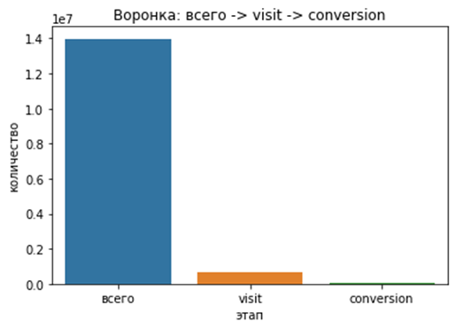
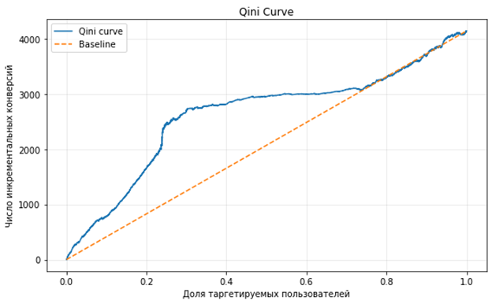
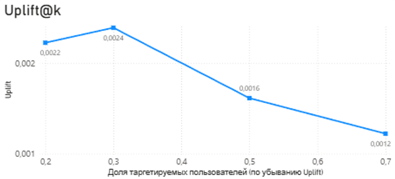
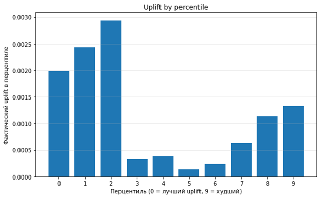
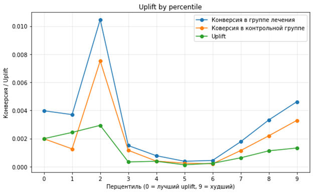

# Uplift Modeling, T-Learner - Criteo Uplift Modeling dataset
### Uplift-моделирование методом T-Leaner

> Проект выполнен в рамках практики и демонстрации навыков в аналитике больших данных и применении аналитических инструментов.
> Скорее всего, вы нашли его, перейдя по ссылке в моем [резюме](https://volgograd.hh.ru/resume/b9758e61ff101768eb0039ed1f437061786156) или сопроводительном письме.
>
> ### Мои другие проекты:
> 
> MySQL:
> [Product Assortment & Sales Queries - Northwind dataset](https://github.com/Didiplant/Product-Assortment-Sales-Queries---Northwind-dataset)
> 
> MS Excel:
> [Product Assortment & Sales Analysis - Northwind Dataset](https://github.com/Didiplant/Product-Assortment-Sales-Analysis---Northwind-Dataset)

Ниже приведен краткий обзор на работу. Более детально изучить процесс и результаты анализа и моделирования можно в приложенных [блокнотах](notebooks).
Также с результатами можно ознакомиться в интерактивном [дашборде](dashboard/Dashboard_UpliftModeling(TLearner)CriteoUpliftModelingDataset.pbix).

### **Цель:**

Оптимизации таргетинга и формирования стратегий по повышению конверсии.

### **Используемые данные:**
Датасет **Uplift Modeling , Marketing Campaign Data** (лицензия: CC0), создан Criteo AI Lab (французская компания, проводящая исследования в области онлайн-рекламы)

Источник: https://www.kaggle.com/datasets/arashnic/uplift-modeling/data

Включает 13 млн строк с результатами рандомизированного контролируемого A/B эксперимента с контрольной (control) группой (15.4%) и экспериментальной (treatment) группой (84.6%).

Каждая строка описывает отдельного пользователя с: 
1.	f0, f1, ..., f11 - 12 признаков пользователя;
2.	treatment - метка группы, где: 1 - экспериментальная группа, 0 – контрольная группа;
3.	conversion — метка, показывающая, произошла ли конверсия у пользователя;
4.	visit — метка, показывающая, посещал ли пользователь сайт;
5.	exposure — метка, показывающая, было ли фактически оказано воздействие на пользователя (оказалась ли реклама замечена/показана).
   
Датасет создан для задач Uplift-моделирования - исследований в области машинного обучения, целью которых является объяснение и оценка причинного воздействия лечения (treatment) на индивидуальном уровне. 
Например, в индустрии цифровой рекламы лечение осуществляется с целью воздействия (exposure) объявлениями/рекламой на пользователей, и Uplift-моделирование помогает направить маркетинговые усилия на тех пользователей, для которых оно наиболее эффективно. 

### **Инструменты и навыки:**
Uplift Modeling (T-Learner), Qini/Uplift@k/UpliftByPercentile метрики, Python (pandas, numpy, matplotlib, seaborn, sklearn), Power BI (дашборд), машинное обучение (логистическая регрессия), аналитика данных.

### **Структура проекта:**

    Uplift-Modeling-T-Learner---Criteo-Uplift-Modeling-dataset/
    ├── dashboard/    # Дашборд с метриками
    ├── data/         # Метрики в формате .csv
    ├── images/       # Изображения из README.md
    ├── notebooks/    # Блокноты с кодом и подробными комментариями
        01_EDA_criteo-uplift.ipynb        # Первичный анализ, анализ распределений, корреляцй, конверсионной воронки, проверка рандомизации
        02_ITT_TOT_criteo-uplift.ipynb    # ITT и TOT оценка
        03_T-Learner_criteo-uplift.ipynb  # Uplift-моделирование, метрики Qini AUC, Qini Curve, Uplift@K, Uplift by Percentile, Overall Uplift
    └── README.md

! Замечание: нет возможности прикрепить оригинальный файл для Qini из-за размера. В data/ можно найти [уменьшенный](data/qini_curve_small.csv) вариант с меньшей точностью. При построении графиков в проекте использовался только оригинальный файл.

### **Результаты анализа датасета:**

На этапе разведочного анализа было выявлено, что наиболее критичным и слабым местом конверсионной воронки является посещение сайта (visit) пользователями. Также обнаружено, что в случае успешного воздействия (exposure = 1) рекламой число конверсий (conversion = 1) многократно повышается, но само назначение (treatment = 1) рекламы дает мало гарантии, что пользователь ее увидит (что exposure = 0).

Это дает основание предположить, что причина низкого числа посещений заключается в низком числе exposure. Сформирована гипотеза: visit является слабой частью воронки из-за малого exposure.

Для проверки использованы методы оценки **ITT (Intention-To-Treat)** и **TOT (Treatment-On-Treat)**
Результаты подтвердили гипотезу: TOT >> ITT как для visit, так и для conversion, с соотношением TOT/ITT = 27.7. Отсюда следует, что реклама работает, но редко видна пользователям.

### **Обоснование модели:**

Для uplift-моделирования используется подход **T-Learner**:
1.	Обучаются две независимые модели для экспериментальной и контрольной групп,
2.	Разделение позволяет снизить ошибки, связанные с выявленным дисбалансом между группами и редкостью целевых событий,
3.	Подход относительно устойчив к обнаруженным выбросам и коррелирующим данным,
4.	Модель при необходимости можно расширить

Поскольку итоговый эффект определяется разностью двух прогнозов независимых моделей, для реализации T-Learner используется логистическая регрессия.

### **Итоги моделирования и анализ метрик:**

**Анализ топ-10 пользователей с максимальным uplift выявил следующие характеристики "сильных" Убеждаемых пользователей:**

- Вероятность конверсии при воздействии в ~2 раза выше, чем базовая.
- Несмотря на отсутствие фактических конверсий даже в treatment-группе, модель предсказывает высокий инкрементальный эффект от рекламы.
- Эти пользователи имеют признаки (f0-f11) клиентов с высокой вероятностью отклика. На эти признаки необходимо ориентироваться при таргетировании, такие пользователи имеют высокий потенциал.

**Ключевые результаты:**

- Топ-30% пользователей дают максимальный эффект uplift, ~60% от всего эффекта.
- Qini AUC = 553.5 - модель качественно ранжирует пользователей и выделяет группу Убеждаемых.
- Overall uplift ≈ ITT - корректная калибровка модели, высокое доверие к предсказаниям модели.
- Оценки по перцентилям имеют меньшую надежность, чем Qini Curve. При принятии решений лучше ориентироваться на результаты Qini.

**Рекомендованная стратегия по результатам моделирования:**

1. Топ-10% - приоритетные пользователи, максимум инкрементальных конверсий. ("Сильные" Убеждаемые)
2. Топ-30% - основной фокус. ("Слабые" Убеждаемые)
3. выше 30% - снижение эффективности, таргетировать с осторожностью.
4. выше 70% - не таргетировать. (Лояльные и Потерянные пользователи)

**Рекомендованная стратегия с учетом анализа воронки, ITT/TOT и uplift-моделирования:**

1. Увеличить exposure до желаемого эффекта - критическое слабое место воронки (TOT/ITT = 27.7). Необходим анализ каналов, видимости и д.р. для большей информации.
2. Таргетинг на топ-10% пользователей по модели uplift - пользователи типа Убеждаемые с инкрементальным эффектом +0.2%. Результат: вероятность конверсии растет в ~1.5-2 раза.
3. Таргетинг на топ-30% для дополнительного прироста - 60-70% всего эффекта по данным Qini.

! Приоритет - exposure, затем персонализация по uplift-ранжированию.

### **Вопросы и направления для дальнейших исследований:**

1.	Связаны ли выбросы с определенными подгруппами – например, пользователями с высокой вероятностью конверсии или наоборот с пользователями, негативно реагирующими на воздействие?
2.	Можно ли удалить сильно коррелирующие признаки - как изменится модель и какие признаки из коррелирующих лучше оставить?
3.	Кластерная визуализация признаков и сопоставление результатов с uplift-квантилями, выявление паттернов Убеждаемых и других типов пользователей.
4.	Как будут отличаться результаты при использовании других моделей (например: X-Learner, R-Learner, Uplift Random Forest)?
